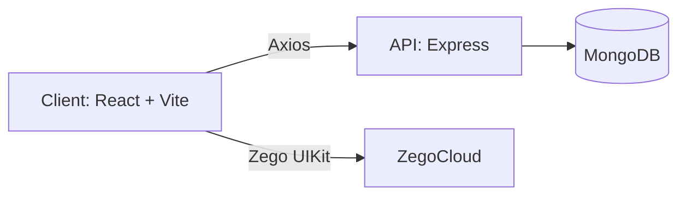

# LearnX

LearnX is a full-stack live session platform for hosting and joining interactive video sessions. It provides authentication, session management, a host dashboard, and real-time video via ZegoCloud's prebuilt UI kit.

## Table of contents

- Overview
- Key features
- Tech stack
- Architecture
- Folder structure
- Frontend overview
- Backend overview
- API reference
- Data models
- Environment variables
- Local setup
- Scripts
- Deployment notes
- Troubleshooting

## Overview

LearnX delivers a simple workflow:

- Users register or log in.
- Hosts create a session and share a room ID or invite link.
- Participants join by room ID.
- Sessions are tracked and can be rejoined from the dashboard.

## Key features

- Email and password authentication with JWT-based sessions
- Host and participant session flows
- Live video, audio, and chat using Zego UIKit
- Session dashboard with active and ended history
- Shareable room ID and join link

## Tech stack

**Frontend**
- React 19 + Vite
- React Router
- Tailwind CSS
- Axios
- react-hot-toast
- ZegoCloud UIKit Prebuilt

**Backend**
- Node.js + Express
- MongoDB + Mongoose
- JWT auth
- bcrypt password hashing
- Nodemailer (OAuth2) for email

## Architecture



## Folder structure

```
client/
	src/
		components/
		context/
		hooks/
		pages/
		services/
		utils/
server/
	src/
		config/
		controllers/
		middlewares/
		models/
		routes/
		services/
		utils/
```

## Frontend overview

**Routing**
- Public: `/`, `/login`, `/register`
- Protected: `/dashboard`, `/host`, `/join`

**State and session management**
- Auth state lives in `AuthContext` and is hydrated from `localStorage` token.
- Session state lives in `SessionContext` and handles create/join/list/leave flows.
- `useZego` manages joining and leaving Zego rooms, and exposes a `containerRef` for the video UI.

**Core pages**
- Home: marketing sections and CTA
- Auth: login/register flows (shared form)
- Dashboard: create/join actions and session list
- Host Session: create and manage a room, copy room ID, end session
- Join Session: enter room ID and join active sessions

**Frontend services**
- `api.js` wraps Axios with JWT headers and 401 handling.
- `zego.js` builds Zego kit tokens, requests media permissions, and joins rooms.

## Backend overview

**Server entry**
- [server/server.js](server/server.js) wires middlewares, routes, and health check.

**Routes**
- [server/src/routes/auth.route.js](server/src/routes/auth.route.js)
- [server/src/routes/session.route.js](server/src/routes/session.route.js)

**Controllers**
- Auth: register, login, get profile
- Session: create, join, list, leave, end

**Middleware**
- JWT auth guard for protected routes
- Central error handler

**Services**
- Email service uses Nodemailer with OAuth2 credentials

## API reference

Base URL: `http://localhost:5000/api`

### Health

- `GET /health`

### Auth

- `POST /auth/register`
	- Body: `{ name, email, password }`
	- Response: `{ user, token }`
- `POST /auth/login`
	- Body: `{ email, password }`
	- Response: `{ user, token }`
- `GET /auth/me`
	- Auth: Bearer token
	- Response: user profile

### Sessions (all require Bearer token)

- `GET /session/list?status=all|active|ended`
- `POST /session/create`
- `POST /session/join`
	- Body: `{ roomId }`
- `GET /session/:roomId`
- `POST /session/end/:sessionId`
- `POST /session/leave`
	- Body: `{ roomId }`

## Data models

**User**
- name, email, password (hashed), avatar, verified

**Session**
- roomId, host, status (active/ended), participants, startedAt, endedAt

**OTP**
- email, otpHash, expiresAt, attempts, temporaryData

## Environment variables

### Server

Create a `.env` file in `server/`:

```
PORT=5000
MONGO_URI=your_mongodb_connection_string
JWT_SECRET=your_jwt_secret
CLIENT_URL=http://localhost:5173

GOOGLE_USER_EMAIL=you@example.com
GOOGLE_CLIENT_ID=your_google_client_id
GOOGLE_CLIENT_SECRET=your_google_client_secret
GOOGLE_REFRESH_TOKEN=your_google_refresh_token
```

Note: The email service imports a config module (`server/src/config/config.js`). If you do not have it, either create it to read from `process.env`, or update the service to use env directly.

### Client

Create a `.env` file in `client/`:

```
VITE_API_URL=http://localhost:5000/api
VITE_ZEGO_APP_ID=your_zegocloud_app_id
VITE_ZEGO_SERVER_SECRET=your_zegocloud_server_secret
```

Note: `api.js` falls back to `VITE_API_KEY` if `VITE_API_URL` is missing. Prefer `VITE_API_URL` for clarity.

## Local setup

### 1) Install dependencies

```
cd server
npm install

cd ..\client
npm install
```

### 2) Run the backend

```
cd server
npm run dev
```

### 3) Run the frontend

```
cd client
npm run dev
```

Open `http://localhost:5173` in the browser.

## Scripts

**Client**
- `npm run dev` - start Vite dev server
- `npm run build` - production build
- `npm run preview` - preview build
- `npm run lint` - run ESLint

**Server**
- `npm run dev` - start with nodemon
- `npm start` - start in production

## Deployment notes

- Client can be deployed to Vercel or Netlify. Set `VITE_API_URL` in the hosting dashboard.
- Server can be deployed to Render, Railway, or a VPS. Ensure `CLIENT_URL` matches your hosted frontend domain.
- MongoDB Atlas is recommended for production databases.

## Troubleshooting

- **401 errors**: token missing or expired, re-login to refresh `localStorage` token.
- **CORS issues**: ensure `CLIENT_URL` matches the frontend domain.
- **Zego video not starting**: allow camera/microphone permissions and confirm Zego app credentials.
- **Email sending fails**: verify Google OAuth2 credentials and ensure a config reader exists.
